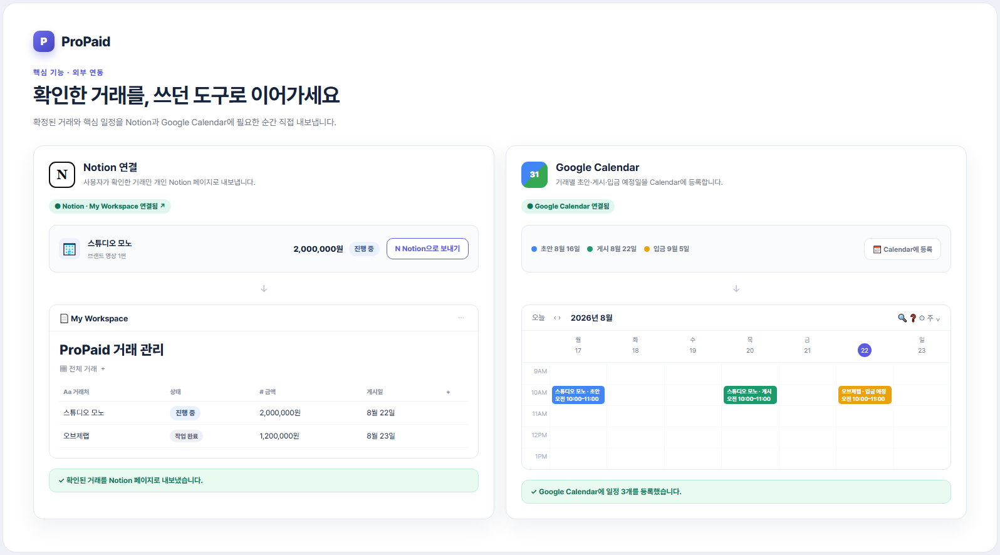
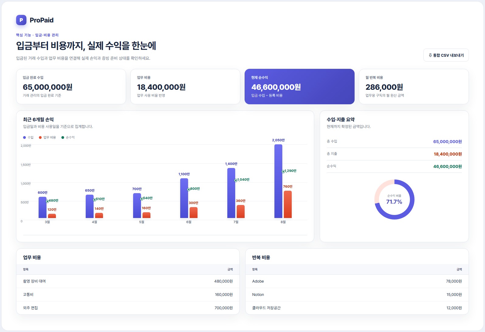

# ProPaid 포트폴리오

> 제안부터 입금까지, 놓치지 않게.

한국 크리에이터·프리랜서·1인 사업자를 위한 협찬·외주 메일 정리 및 거래 관리 서비스입니다.
운영 사이트: [propaid-api.ionjk2879.workers.dev](https://propaid-api.ionjk2879.workers.dev)

## 문제 정의

프리랜서와 크리에이터에게 들어오는 협찬·외주 제안 메일은 거래처, 금액, 결과물, 납기, 수정 횟수, 지급 조건이
비정형 텍스트로 흩어져 있습니다. 이를 놓치면 계약 조건 누락, 입금 지연, 실제 수익 파악 실패로 이어집니다.

ProPaid는 이 흐름을 하나로 연결합니다.

```text
협찬·외주 제안
→ 구조화 및 누락 조건 감지
→ 사용자 확인
→ 거래 저장
→ 작업 일정 관리
→ 입금 상태 관리
→ 업무 비용 차감
→ 실제 수익 확인
```

## 핵심 기능

### 1. 제안 메일 구조화 분석

메일 원문을 붙여넣으면 거래처, 거래 유형, 금액, 결과물, 초안·게시 납기, 수정 횟수, 2차 활용 조건,
지급 조건을 추출하고 누락된 계약 조건과 작업 체크리스트를 함께 제시합니다. 명시되지 않은 값은 추측하지
않고 확인이 필요한 항목으로 표시합니다. `ANTHROPIC_API_KEY`가 있으면 Claude Structured Outputs를 사용하고,
없거나 호출에 실패하면 규칙 기반 분석기로 자동 복귀합니다.

### 2. 거래 파이프라인 관리

확인한 분석 결과는 사용자 확인 후 거래로 저장되며 `확인 필요 → 확정 → 진행 중 → 작업 완료 → 입금 완료`
상태로 관리합니다. 칸반형 파이프라인 보기와 목록 보기를 전환할 수 있고, 입금 지연 거래는 별도 작업
화면에서 확인 메일 초안과 함께 모아 보여줍니다.

### 3. 외부 연동 — Notion · Google Calendar

사용자가 직접 확인한 거래만 선택적으로 내보냅니다. Notion Public OAuth로 연결하면 `ProPaid 거래 관리`
데이터베이스를 워크스페이스에 자동 구성하고, Google Calendar에는 초안·게시·입금 예정일을 등록합니다.
자동 동기화가 아닌 사용자 트리거 기반 내보내기로, 확인되지 않은 거래가 외부로 새어 나가지 않습니다.



### 4. 입금·비용 통합 재무 관리

입금 완료된 거래 수입과 일반 비용·반복 구독 비용을 연결해 실제 순수익을 계산합니다. 비용은 업무 사용
비율과 증빙(영수증·세금계산서 등)·공제 검토 상태를 함께 기록하며, 최근 6개월 손익 추이와 수입·지출 요약을
한 화면에서 확인할 수 있습니다. 신고 준비를 위한 통합 CSV도 내보낼 수 있습니다.



## 기술 스택

| 영역 | 구성 |
| --- | --- |
| 프론트엔드 | React 18, TypeScript, Vite, React Router, Recharts, Pretendard |
| 백엔드 | Cloudflare Workers, Hono, TypeScript |
| 데이터베이스 | Cloudflare D1 |
| 파일 저장 | Cloudflare R2 (증빙 업로드) |
| 인증 | Google OpenID Connect |
| 외부 연동 | Notion Public OAuth API, Google Calendar API |
| 메일 수신 | Resend Inbound (웹훅 서명 검증) |
| AI 분석 | Claude Messages API Structured Outputs (선택적, 규칙 기반 분석기로 폴백) |
| 배포 | GitHub `main` push → Cloudflare Workers Builds 자동 배포 |

레거시 Spring Boot 구현은 `backend/`에 전환 검증용으로 보존되어 있으며, 운영 런타임은 1인 개발 운영비를
최소화하기 위해 Cloudflare Workers + D1으로 전환했습니다.

## 아키텍처 특징

- **사용자 확인 우선**: AI/규칙 기반 분석 결과는 항상 사용자가 확인해야 거래로 확정되며, 외부 연동도
  사용자가 선택한 거래만 내보냅니다.
- **최소 권한 인증**: Gmail 전체 읽기 권한을 사용하지 않고, 메일 원문 붙여넣기와 사용자별 전달 주소만으로
  MVP 입력을 구성합니다.
- **암호화된 연동 토큰**: Notion OAuth 토큰은 `JWT_SECRET`에서 파생한 AES-GCM 키로 암호화해 D1에
  저장하며, 연결 해제 시 즉시 삭제합니다.
- **AI 장애 허용**: Anthropic API 키가 없거나 호출이 실패해도 규칙 기반 분석기가 핵심 흐름을 계속
  지원합니다.

## 진행 상태

Cloudflare 기반 핵심 흐름(제안 분석 → 거래 저장 → 상태 관리 → 재무 관리)과 Notion Public OAuth 연동이
운영 검증을 마쳤습니다. 다음 단계는 파이프라인 카드에서 바로 상태를 변경하는 UX 개선, Google Calendar
일정 자동 생성, Google Sheets 내보내기와 첨부파일 OCR 분석입니다. 자세한 현재 구현 목록은
[`PROJECT_STATUS.md`](./PROJECT_STATUS.md), 제품 방향과 요금제 가설은
[`PRODUCT_DIRECTION.md`](./PRODUCT_DIRECTION.md)에서 확인할 수 있습니다.
